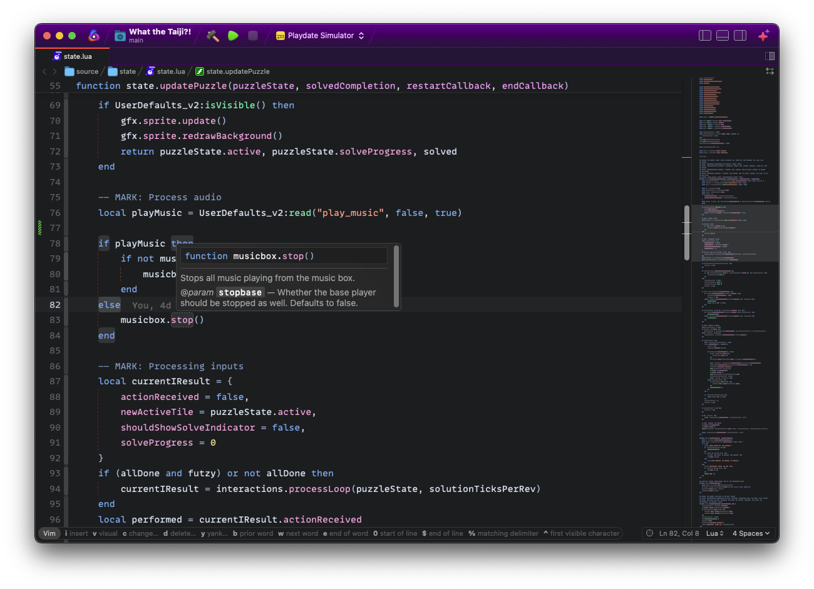

**LuaLS** provides deep integration with **Lua** through the [Lua Language Server](https://luals.github.io/) project.

## Requirements

LuaLS requires some additional tools to be installed on your Mac:

- [Lua Language Server](https://luals.github.io)

<!--
✨ Providing tips, tricks, or other guides for installing or configuring external dependencies can go a long way toward helping your users have a good setup experience:
-->

> To install the current stable version of Lua Language Server with Homebrew, run `brew install lua-language-server`.

## Usage

LuaLS runs any time you open a local project, automatically lints all open files, then reports errors and warnings in Nova's **Issues** sidebar and the editor gutter.

### Configuration

To configure global preferences, open **Extensions → Extension Library...** then select LuaLS's **Preferences** tab.

Likewise, you can write a custom `.luarc.json` file in your local project to control the behaviors of LuaLS.

[Configure LuaLS &rsaquo;](https://luals.github.io/wiki/configuration/)
